<div align="center">

# CrossFlow

**City-scale traffic intelligence: see every vehicle, then decide who gets green.**


-E4405F)

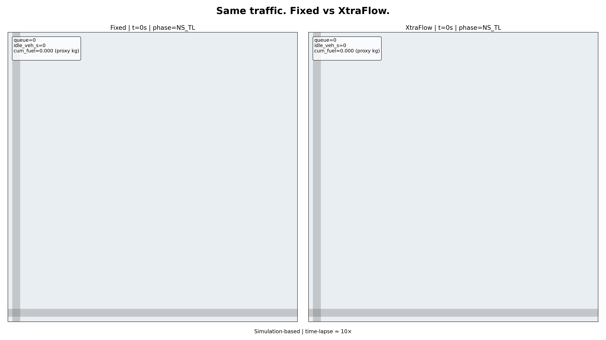

<em>Same demand and seed. Fixed-time signals (left), fuel-weighted adaptive control (right).</em>

</div>

---

## Overview

CrossFlow is a traffic platform in two connected layers.

| Layer | Module | What it does |
| --- | --- | --- |
| **Sense** | [`crosssight/`](crosssight/README.md) | City-wide ANPR: plate reads from a camera network become trajectories, flow analytics, real-time alerts and a GIS control-room dashboard. |
| **Act** | [`xtraflow/`](xtraflow/README.md) | Fuel-weighted adaptive signal control, benchmarked in SUMO against fixed-time, Webster, actuated and pressure baselines under locked, seeded evaluation. |
| **Connect** | [`crossflow/`](crossflow/) | The product layer: converts camera counts into per-arm demand, runs the signal-control study on it, and serves the results to the API and dashboard. |

Cameras measure how much traffic arrives from each side of a junction and what kind of vehicles it
is. That measured demand drives the signal-control study, and the comparison appears next to the
camera analytics in the control room.

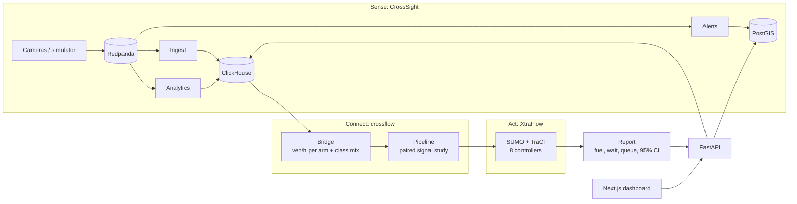

---

## Quick start

Requirements: Python 3.12, [`uv`](https://docs.astral.sh/uv/), Node 20+ and Docker (platform services only).

```bash
make setup        # one Python environment for everything, plus the SUMO networks
make test         # every test suite
make demo         # city cameras -> measured demand -> signal-control study (about 1.5 min)
make serve        # platform and dashboard in Docker: http://localhost:3000
```

`make demo` needs no database or message bus. It simulates a city day, takes the busiest four-arm
junction-hour, converts camera counts to veh/h per arm, and runs four controllers on paired seeds
in SUMO. The report lands in `runs/<id>/report.md` and on the dashboard's **Signals** page.

```text
crossflow run [--full] [--seeds N] [--streams N] [--hour H] [--assumed-mix]
crossflow city                 what the simulated city produces, without SUMO
crossflow bridge --flows ...   convert FlowWindow counts into calibration input
crossflow status               published results and the latest run
```

---

## Control-room dashboard

Next.js dashboard with role-based access (admin, operator, analyst).

<table>
  <tr>
    <td width="50%"><b>Live</b>: reads, alerts, speeds and congested segments on the city map<br>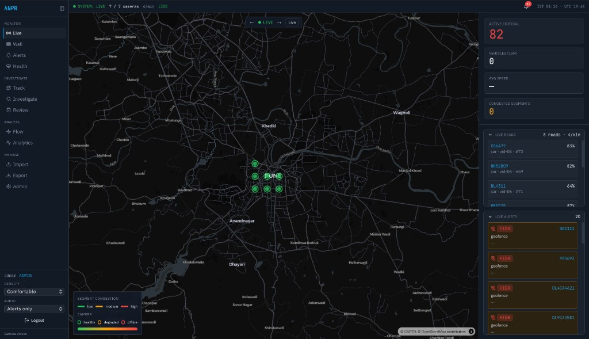</td>
    <td width="50%"><b>Wall</b>: live camera grid with plate overlays<br>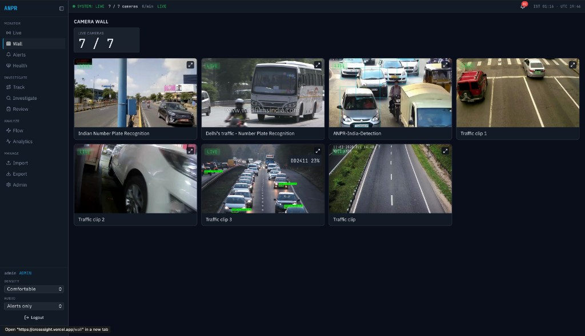</td>
  </tr>
  <tr>
    <td><b>Alerts</b>: severity, type and status filters, plotted on the map<br></td>
    <td><b>Track</b>: plate search, read timeline and path playback<br>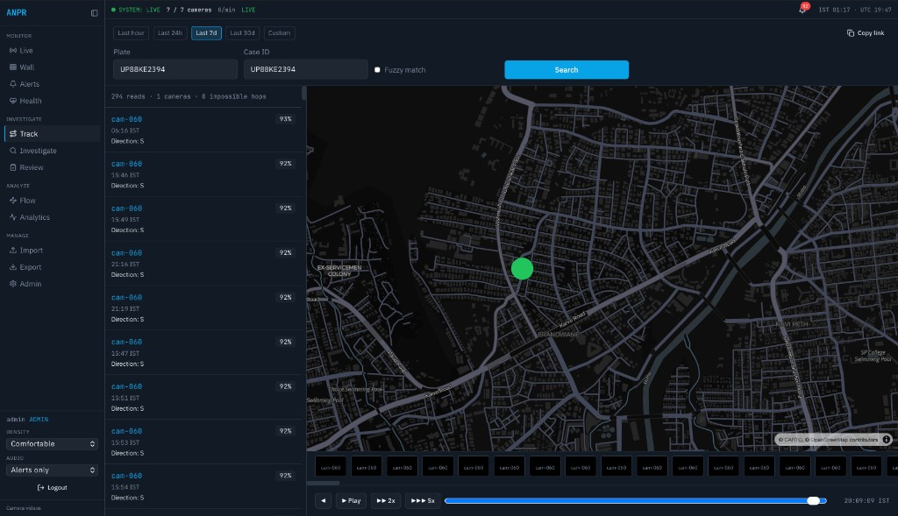</td>
  </tr>
  <tr>
    <td><b>Flow</b>: origin-destination, travel time and vehicle classes<br></td>
    <td><b>Analytics</b>: corridor density, bottlenecks and volume anomalies<br>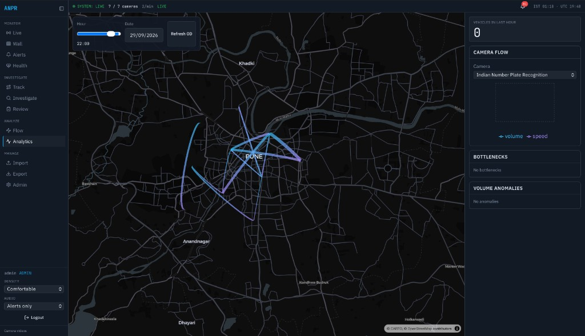</td>
  </tr>
  <tr>
    <td><b>Review</b>: enforcement queue with approve, dismiss and export<br></td>
    <td><b>Import</b>: CCTV and plate stills, watchlist and camera-table ingest<br></td>
  </tr>
</table>

### Signal control

The **Signals** page shows the published signal-control evaluation, the latest pipeline run, and a
live demand measurement from named cameras.

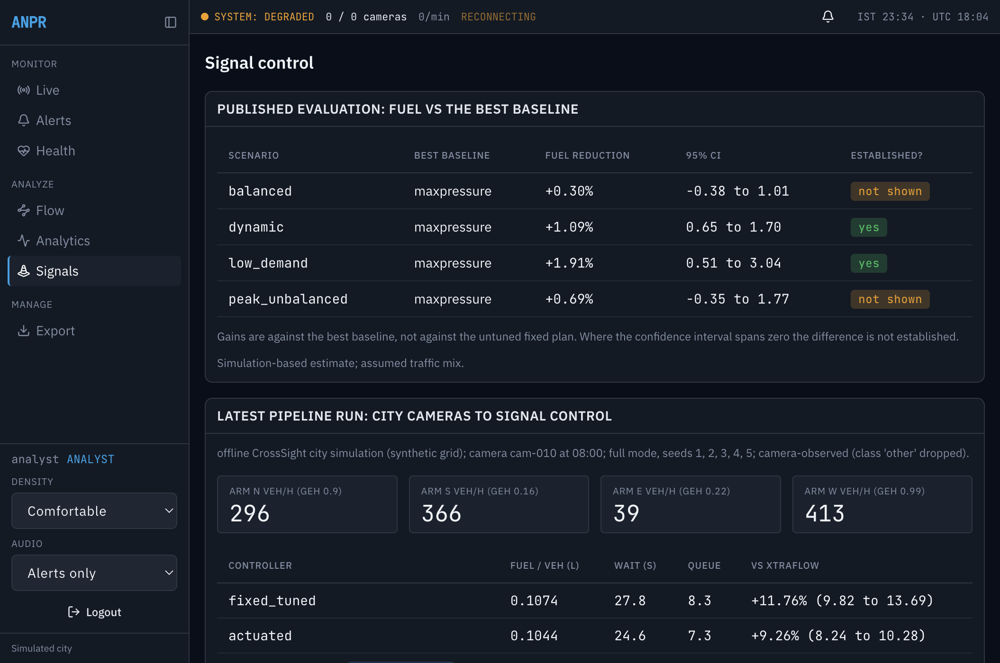

---

## Capabilities

### Sense: ANPR and city analytics

| Area | What is in place |
| --- | --- |
| Plate reading | PlateOCR `india-v1.1` with Indian format decoding, deblur, lane attribution, multi-frame fusion, fleet CLI with RTSP reconnect; legacy YOLO + PARSeq path |
| Stream processing | Ingest, analytics (per-lane flow, congestion, origin-destination, route density, bottlenecks) and alert workers on Redpanda |
| Alerts | Watchlist, cloned plate, convoy, loitering, geofence, wrong-way, route anomaly, registry mismatch |
| API | Trajectory reconstruction with RBAC and audit, heatmap, flow, segments, OD, bottlenecks, anomalies, alert workflow, evidence crops |
| Privacy | Analysts cannot query plates; case ID required; audit log; retention TTL; k-anonymity on OD cells |
| Simulator | Synthetic city with about 60 cameras and scripted watchlist, clone, convoy, loiter, wrong-way and geofence cases |

### Act: fuel-weighted signal control

| Area | What is in place |
| --- | --- |
| Controller | Scores each approach by estimated fuel pressure (who waits, what they burn, which turn they need) under min/max green, yellow and all-red limits, with starvation protection |
| Baselines | Fixed (legacy and tuned), Webster, SUMO actuated, queue pressure, max pressure, count-only ablation; PPO trained but unscored |
| Scenarios | Balanced, peak unbalanced, dynamic blocks, low demand |
| Evaluation | Train / validation / test seed split, config hash lock, tripinfo fuel, SSM safety conflicts, paired comparisons |
| Extras | Detection-miss robustness, demand and mix sensitivity, emission cross-check, YOLO CCTV demo, Streamlit dashboards, auto-filled deck |

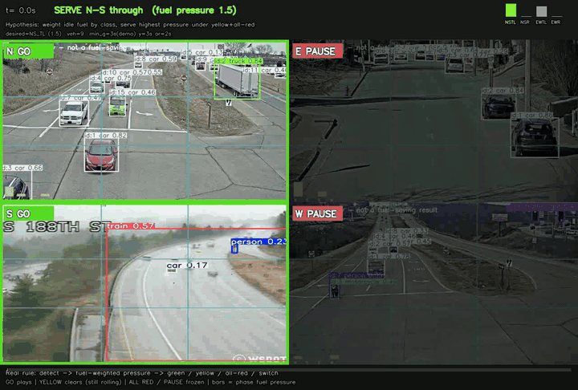

<p align="center"><em>Hypothesis on camera: detect who waits, score fuel-weighted phase pressure, then green / yellow / all-red. Input feasibility, not a fuel claim.</em></p>

### Connect: measured demand to signal study

* **Bridge**: `FlowWindow` counts to veh/h per arm and a vehicle-class mix (`motorcycle` to `two_wheeler`, `auto` to `auto_rickshaw`; `other` is dropped, not guessed).
* **Pipeline**: scales XtraFlow demand per arm, runs controllers on paired seeds in parallel SUMO processes, and reports against the **best** baseline with a 95% interval.
* **API**: `GET /signals/summary`, `GET /signals/runs/latest`, `GET /signals/demand?cameras=cam-001:N,cam-002:S&from=...&to=...`.

---

## Results

### Signal control (locked TEST, seeds 1-5, four scenarios, eight controllers)

| Comparison | Fuel change (positive = XtraFlow better) | Reading |
| --- | --- | --- |
| vs fixed, Webster, actuated | about **8-17%** (actuated closer to 5-11%) | Adaptive pressure beats weaker baselines |
| vs best pressure baseline | **0.3-1.9%** | Interval spans zero on balanced and peak-unbalanced |
| vs count-only ablation | about **0-2%** | Clear only at low demand |

<table>
  <tr>
    <td width="50%">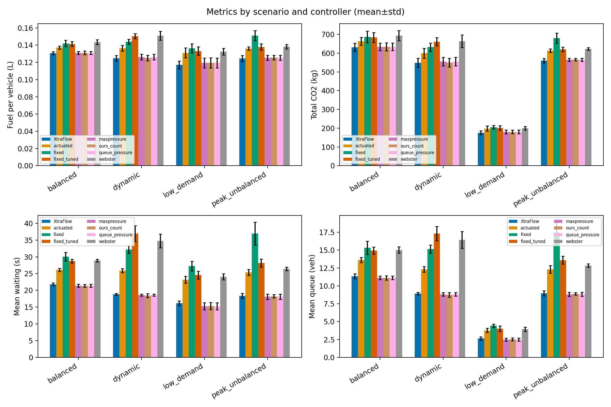</td>
    <td width="50%">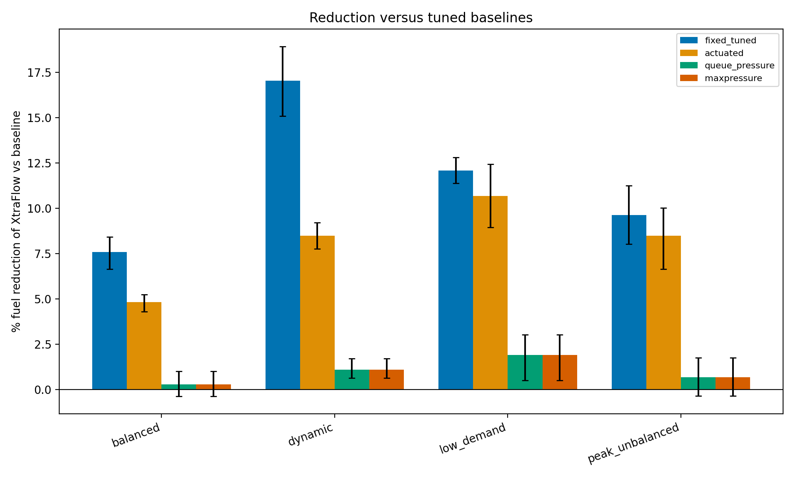</td>
  </tr>
  <tr>
    <td>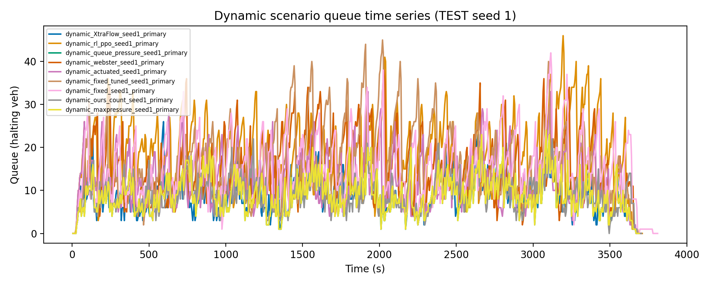</td>
    <td></td>
  </tr>
</table>

More figures, methods and the raw runs: [`xtraflow/results/REPORT.md`](xtraflow/results/REPORT.md),
[`xtraflow/results/headlines.json`](xtraflow/results/headlines.json).

### End to end: cameras to signal control

`make demo-full` on the simulated city (5 paired seeds, camera-observed vehicle mix):

| Controller | Fuel / vehicle (L) | Mean wait (s) | Mean queue |
| --- | ---: | ---: | ---: |
| Fixed (tuned) | 0.1074 | 27.8 | 8.3 |
| Actuated | 0.1044 | 24.6 | 7.3 |
| Queue pressure | 0.0955 | 18.6 | 5.5 |
| **XtraFlow** | **0.0947** | 18.7 | 5.6 |

XtraFlow used 11.8% less fuel than tuned fixed and 9.3% less than actuated, and 0.75% less than queue
pressure with a 95% interval of -0.44 to 1.95, which is **not an established difference**. The full
run is in [`docs/SAMPLE_RUN.md`](docs/SAMPLE_RUN.md).

### OCR (measured 2026-09-30)

| Claim | Model | Dataset | Exact | Char | n |
| --- | --- | --- | ---: | ---: | ---: |
| Multi-region | `cct-s-v2-global-model` | OpenALPR EU + BR + US | **91.7%** | 98.1% | 444 |
| India, crops | `india-v1.1` + format decode | ~30 states | **73.0%** | 92.9% | 1,684 |
| India, synthetic | `india-v1` + format + TTA | MH / KA / DL / GJ | 67.8% | 96.2% | 400 |
| India, full scenes | `india-v1` + format + pad/TTA | detect + OCR | 60.0% | 77.1% | 25 |
| India, no fine-tune | global model | ~30 states | 31.1% | 77.3% | 1,684 |

Tables and reproduction: [`crosssight/reports/ocr_benchmark.md`](crosssight/reports/ocr_benchmark.md).
Indian multi-lane night or rain performance above 90% is **not** claimed.

---

## Limits you should know

* Signal-control results are **simulation estimates** on an assumed mixed-traffic demand, with proxy emission classes. They are not field results.
* The controllers run with `info_mode: oracle` (XtraFlow's default): they read SUMO ground truth for vehicle position, speed, class and turn, **not camera detections**. In a pipeline run the cameras only set the demand scale and vehicle mix, so detector errors are not reflected in the signal-control numbers.
* The large 8-17% fuel figures are against fixed, Webster and actuated control. Against the best pressure baseline the gain is 0.3-1.9% and often not statistically established; the pipeline reports it that way.
* XtraFlow's parameters were tuned on its assumed demand and mix, not on the measured demand a pipeline run uses.
* The demo city is CrossSight's synthetic grid. Its scheduler starts about 150 trips a day, so `--streams` (default 2000) superimposes independent scheduler runs to reach junction-scale flow; the factor is recorded in every report.
* In the published runs `maxpressure` is bit-identical to `queue_pressure`; treat them as one baseline until re-run. Details: [`xtraflow/STATE.md`](xtraflow/STATE.md).

---

## Repository layout

```text
crossflow/     bridge, simulated city, pipeline, results reader, CLI, tests
crosssight/    services (api, workers, simulator, ocr_engine), packages, dashboard, OCR reports
xtraflow/      SUMO network and demand, controllers, experiments, perception, demo, locked results
scripts/       bridge_demo.sh: camera counts to SUMO calibration with a GEH check
docs/          architecture, verification record, sample run, screenshots
pyproject.toml, uv.lock   the single Python 3.12 environment
```

## Documentation

| Document | Contents |
| --- | --- |
| [`docs/ARCHITECTURE.md`](docs/ARCHITECTURE.md) | Modules, contracts, design rules |
| [`docs/VERIFICATION.md`](docs/VERIFICATION.md) | What was run, results, known issues |
| [`docs/SAMPLE_RUN.md`](docs/SAMPLE_RUN.md) | A recorded end-to-end run |
| [`crosssight/README.md`](crosssight/README.md) | ANPR platform guide: OCR, alerts, scaling, privacy |
| [`xtraflow/README.md`](xtraflow/README.md) | Signal-control guide: methods, YOLO demo, limits |

## Continuous integration

`.github/workflows/crossflow.yml` runs, in one environment: the CrossFlow, XtraFlow and CrossSight
test suites, the camera-counts-to-SUMO calibration check, and an end-to-end pipeline run.
Component workflows for CrossSight and XtraFlow run on their own paths.

Third-party material stays under its original terms (for example `crosssight/vendor/PlateOCR` and
the [CityFlow](https://arxiv.org/abs/1903.09254) city-scale tracking benchmark).
